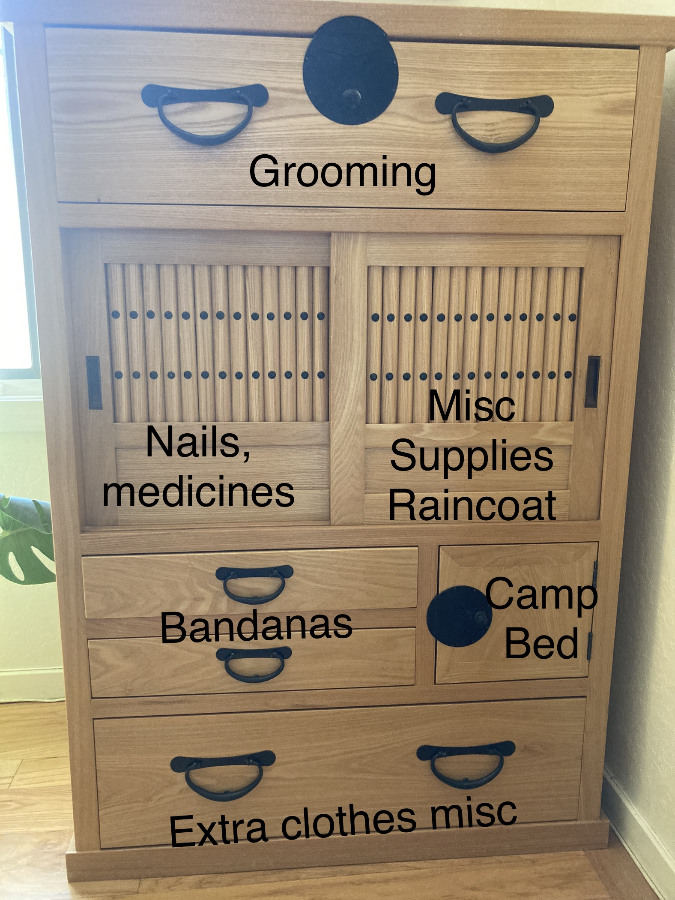

# Overview about Kali

* Kali is currently eating 80 g of Taste of the Wild Salmon kibble with a bit of foam topper each meal. She eats a meal in the morning (anywhere between 7-9am) and at night (anywhere between 5-7pm).
* After she eats, we put her toys away (up on a chair or somewhere she can't reach) because if she roughhouses with her toys, she sometimes vomits up her food. She will end up eating her vomit usually, but it's just kind of gross.
  + This may not be so relevant at home in SB if she goes on a walk immediately or shortly after a meal.
* We wash Kali's water bowl every morning and her food bowl after each meal. She gets filtered tap water.
* Kali walks once in the morning (anytime between 7am - 10am) and once in the evening (anytime between 6-9pm). We usually walk her for anything between 4-8 blocks (maybe 0.5 - 1 mile). 
* After her walk, we use a wet paper towel or a doggy wet wipe to 1) wipe her eye crusties, 2) wipe under her chin, 3) wipe her pee-pee area, then 4) whipe her butt if she pooped.
* We wipe her paws with a dog foot towel (dedicated dish towel). If she's really dirty, we use the paw wash.
* She usually poops once in the morning and once at night. Sometimes she poops more when she is excited by other dogs' smells.
* In addition to her walks, we let Kali in the backyard first thing in the morning and in the evening after dinner. If we are home, we also let her play in the backyard in the afternoon.
* Kali has very poor recall. She is very spotty at responding to `Come here` or `C'mere`! She will get excited and distracted by other dogs and animals such as lizards, squirrels, etc. So we do not let her off-leash unless she is inside a fully enclosed back yard or the dog park. We give her a BIG TASTY TREAT every time she does do a good `C'mere`!
    + Currently, she enjoys the treats from Korea (thanks Ne) and the [Orijen chew treats](https://external-content.duckduckgo.com/iu/?u=https%3A%2F%2Ftse2.mm.bing.net%2Fth%3Fid%3DOIP.UlmlJTs4o905UirWZvaoggHaHa%26pid%3DApi&f=1&ipt=61b93bb634b42216b87611d2e37fd3ab7d51b3630b4c843df4a6b2569843ff06&ipo=images)
    + She generally likes soft, cheesy or meaty freeze-dried treats. She dislikes dry treats like biscuits or treats that are not made out of dairy or meat.
* We comb Kali when there are obviously sticks and suchlike in her legs using the Furminator fur rake.
* Kali's nails should be ground once a week with the nail grinder. There is also a diamond nail file in her grooming kit (the navy blue bag).
* Kali sometimes has seasonal allergies. These have manifested as her scratching her chin on surfaces (contact dermatitis). She does not tend to exhibit other forms of dog allergies like chewing her elbows or paw pads. If she is scratching her chin for more than 1-2 days, you can give her 1 Claritin or Zyrtec (we usually give Zyrtec) in a pill pocket per day.
* Kali gets a bath every 4-6 weeks, and her doggy shampoos, Zoom Groom, etc. are all in the laundry room, along with the rubber hair catch which seems to do a better job trapping her fur. Her dog towels are in the cabinet, top drawer -- see below.
* The photo below shows the organization of Kali's cabinet.

### Snacks

* Kali enjoys small treats like breaking up the jerky treats into smaller pieces.
* Kali enjoys eating:
  + watermelon (small pieces, cannot be the rind, lol)
  + carrot (sometimes, tiny pieces)
  + apple (sometimes, tiny pieces; she likes sweet apples like Honeycrisp rather than tangy ones like Pink Lady)
  + white nectarine (small pieces)
  + banana (small pieces and small quantity)
  + blueberries (sometimes we have to smush one open to entice her)
  + mango 
* We sometimes (usually we've been forgetting) give her treats when she behaves well on walks (we just put some treats in a Ziploc bag then give her individual treats on the walk). She gets 1 treat for each instance of good behavior (e.g. ignoring a squirrel that she was inclined to chase).
* She can also have a small fruit or food treat in the afternoon if you'd like. We don't do this everyday so no worries if you don't have time to do this. She might also be fussy and drop the food on the ground anyways.

## Care guide for Kali

### Feeding and general care

* We wash Kali's water bowl every morning and her food bowl after each meal. She gets filtered tap water.
* Kali currently eats [Taste of the Wild Ancient Wetlands](https://www.chewy.com/taste-wild-ancient-wetlands-ancient/dp/217988) kibble
    + We estimate her caloric needs to be around 320 KCal/day
    + Her current kibble has a caloric density of 4 Kcal/gram
* On inactive days (e.g. no hiking, no trail running), she should eat **80** grams of kibble in the morning and **80** grams of kibble in the evening (or thereabouts; total **160-190** grams).
    + We feed her in the morning and again in the evening because she cannot ingest enough food in one sitting to meet her caloric requirements.
    + Typically we leave her food out for less than an hour--we are trying to encourage her to not graze on her food through the day.
* On active days, she should eat **90** grams of kibble in the morning and **90** grams of kibble in the evening (total: **180-200** grams).
* She eats at around 8am in the morning and 6pm in the evening. This is fairly flexible, but she is unlikely to be hungry before 8am.
    + Currently she accepts kibble with some chicken sprinkle in the morning.
    + In the evening, her appetite is usually better and she often eats the kibble plain.
* If these tricks do not work, you can try adding a little bit of vegetable oil (we just use olive oil) to her food, or squeezing some watermelon on top of it, or sprinkling some milk.
* We brush Kali's teeth at night. We wet her toothbrush, squeeze some toothpaste on it, and brush it over her teeth. If that is infeasible, you can put some toothpaste on her kong and let her play with that toy. And you can let her lick and chew at her toothbrush with toothpaste on it.
* We comb Kali once every 2-3 days using the Furminator fur rake.

#### Snacks

* Kali enjoys small treats like the Orijen beef liver treats
* Kali enjoys eating:
  + watermelon (small pieces)
  + carrot (sometimes, tiny pieces)
  + apple (sometimes, tiny pieces; she likes sweet apples like Honeycrisp rather than tangy ones like Pink Lady)
  + white nectarine (small pieces)
  + banana (small pieces and small quantity)
  + blueberries (sometimes we have to smush one open to entice her)
  + mango (and mango lassi)
  + pear (sweeter varieties)
* We give her treats when she behaves well on walks (we just put some Zuke's treats in a Ziploc bag then give her individual treats on the walk). She gets 1 treat for each instance of good behavior (e.g. ignoring a squirrel that she was inclined to chase).
* She can also have a small fruit or food treat in the afternoon. We typically do not table feed her.

Toxic foods for dogs [include](https://www.akc.org/expert-advice/nutrition/fruits-vegetables-dogs-can-and-cant-eat/):

* cherries
* grapes
* chocolate
* onions
* avocado
* stone fruit pits
* citrus (not toxic but unpleasant for them)
-->

## Medication 

Kali is on preventive medications for fleas, ticks, and worms. 

Heartguard - 1x a month. This comes in a green box and is a long rectangular soft chew. She likes this broken up into 2-3 pieces and fed as a treat. 

Nexgard - 1x a month. This comes in a white box with blue lettering, and is a hard brown square chew. Sometimes Kali will spit it out because she doesn't like the texture. In this case, break it up and use a Pill Pocket to encase it and make it softer. 

## Veterinary information

*Current veterinarian*

**Northern California**
[Saratoga Veterinary Hospital, Dr. Rof Carpio](https://saratogavethospital.com/), phone: (408) 548-0953, [digital health record link](https://cooldvm.vetport.com/). The login and password are saved on Mom's computer.

**Southern California**
[Western University Pet Health Center](https://pethealthcenter.westernu.edu/), phone:  (909) 865-2433 - last check-up on January 6, 2022. Kali is up-to-date on all of her vaccines.

*Past veterinarians*

* Initial veterinarian in Claremont: Dr. Charanpreet Boparai at [Alleve Animal Hospital](http://allevevet.com/staff.php) (check-up in October 2019 with care through fall 2020 when she shifted to Western Pet Health Center)
* Veterinarian in Tennessee: Dr. Cathy Carr at [Powell Animal Hospital](https://www.powellanimalhospital.com/)
* Western University Pet Health Center should have all of the relevant documents from Kali's treatments in Tennessee.

## Microchip information

Kali is microchipped with the brand "Save this Life". Her microchip ID is `991001001483928`. You can see her [online profile here](https://www.savethislife.com/991001001483928).

### Commands

Kali knows the following commands. The commands in **bold** have high adherence; *italics*, slightly less adherence; and normal font denotes questionable adherence.

#### Functional commands

* **Curb**
    + A command to remind Kali to sit at the curb before crossing any intersection.
* **Sit**
    + Given with a flat hand facing up
* **Down**
    + Point your hand toward the ground
* **Wait** (useful when you want her to sit/down while you open a door)
    + Point your hand or two fingers toward the ground
* **Stay**
    + Make a flat palm (like a stop sign) with your hand in front of her face
* *Leave it*
    + Used to get her to drop the ball or ignore the exciting squirrel (more difficult)
    + No hand signal
* Put toys away: fetch, then "put it away"
    + I do this with her kibble and point at the toy for her to fetch then point at the basket for her to drop the toy.
* Come here
    + Squat down low and wave your hands
    + Wave your hand toward your body
* **Release** (to end a successful stay or wait)
* *Stand* (stand up from a down, useful for paw washing)
    + Pull hand up, as though you are opening a drawer
* **Heel**
    + Walk alongside you
    + Reinforced by putting your hand in front of her face and/or shortening the leash
    + Signalled by putting your hand flat in front of her during a walk
* **Take it** (mostly used to get her to eat food)
    + No hand signal
* *Look at me* 
    + useful to obtain Kali's attention when she is distracted by something enticing like a squirrel
    + No hand signal
    + Sometimes we just get up in her face if she is really distracted and make her sit instead of continuing the walk (Walking and chasing the prey is a reward)
* *Point*
    + If you stick out two outstretched fingers in a downward point, Kali should walk to the point
* *Paw* 
    + Gets Kali to untangle herself from her own leash
    + No hand signal
* Don't lick
    + Don't kiss/lick my face
* **Get on**
    + Jump on a sofa or bed
* **Get off**
    + Jump off a sofa or bed
    + No hand gesture; but if she ignores you, you can make a shoving motion with your hands

#### Party tricks

* *Spin*
    + Point fingers together and spin in a circle in front of her snout
* **Gong Xi**
    + Lift hand above her head
* *Shake* 
    + Shake hands
    + First get Kali in a sit position
    + She should know to do this if you extend your hand toward her chest
* Play Bow
    + Point two fingers straight down
* *Crawl*
    + From an incomplete down (body is down but hips are not turned/rolled, like sphinx posture), you gesture forward with your fingers using a treat as a lure
* Roll over
    + She has to be a down position first, then she can be lured to roll over
    + We lure her by having a treat and slowly circling the treat around her head/shoulders
* Weave 
    + walk through legs like weaving poles
* Cross paws
    + Kali has probably forgotten this trick
* Place
    + go to a mat or a specific location
* Speak
    + bark on command; Kali doesn't really know this one yet
* Footsie
    + come between legs and stand on feet

<!--
### Walking & Exercise

* Kali goes outside twice a day (on two walks, or a walk + hike or run).
* We ask Kali to sit before we put on her collar and leash to reinforce good, calm behavior.
* In addition to her walks, we let Kali in the backyard first thing in the morning and in the evening after dinner. If we are home, we also let her play in the backyard in the afternoon.
  + Kali may poop in the backyard in the morning before eating and before her walk.
* Kali is an escape artist so she cannot be left in the backyard alone for a long time.
* We take her out in the morning between 7:30am - 10am and typically walk her for 10-20 minutes.
    + Usually Kali will poop on a longer walk.
* Her evening walk happens between 6 - 8pm, depending on temperature and day length. This walk is usually 15-20 minutes.
* Throwing the Chuck-It toy with Kali in the backyard (or a fenced in dog run) is a great way to work out some of her excess energy.
* We do not recommend letting Kali be off leash in an unfenced area. Her recall is spotty.
* If Kali is being unruly on a walk, just stop and have her sit until she calms down. Walking and smelling is the ultimate reward for her, so this is an effective way to deal with things like jumping squirrels.
* When other dogs approach Kali to sniff her, she is usually fine. However, if the other dog is overly excited or a male dog who is larger than her, she may raise her hackles. In this case, Kali can be walked away from that situation. She is generally very calm and does not instigate with other dogs. She does like to try and sniff dogs who are smaller than her.
* We use the foot towel to wipe dirt off her feet. If her paws are really dirty, we use the paw wash.
* To use the paw wash, fill it to the halfway or 3/4 mark with water. One by one, stick each of her feet into the paw washer and gently raise and lower the leg so that the squeegees on the side can remove dirt and mud. Then we squeeze the water out of her fur and dry her off with the foot towel.
* When she has pooped, we wet a paper towel and wipe her bottom and tail (especially where the tail may touch her bottom).
-->

### Emergency care

* Clinic in Saratoga: [Saratoga Veterinary Hospital](https://www.saratogavethospital.com/contact)
    + Contact phone: 408-548-0953
    + Hours: Mon - Sat: 8:00 AM - 8:00 PM; Sun: CLOSED
    + Address: 12297 Saratoga Sunnyvale Road, Suite 100, Saratoga, CA 95070
* First choice emergency hospital: [South Bay Animal Hospital & Pet Resort](http://www.sb-animalhospital.com/)
    + Contact phone: 408-899-4791
    + Should be open 24/7, 365 days a year
    + Address: 5188 Moorpark Ave., San Jose, CA 95129
* Back up emergency hospital: [United Veterinary Specialty and Emergency](http://unitedvet.com/)
    + Contact phone: 408-371-6252
    + Address: 905 Dell Ave, Campbell, CA 95008
    + Secondary Location (open overnight on weekdays and all day on weekends): 601 Showers Drive, Mountain View, CA 94040

